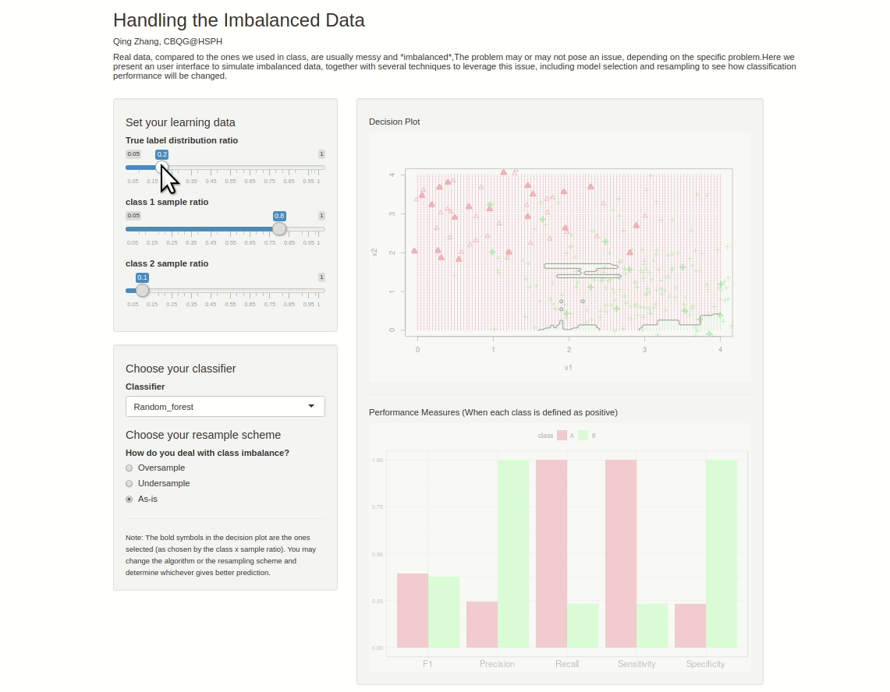

# Harvard Data Science Animation Contest Sumbission Template

# SUBMISSION TITLE

**Author**: Qing Zhang

**Affiliation**: M.S. Computational Biology and Quantative Genetics, at Chan School of Public Health

**Artifact:**
*Insert embedded .gif of submission [(see how to)](https://stackoverflow.com/questions/34341808/is-there-a-way-to-add-a-gif-to-a-markdown-file) OR link to web app:*

**Code:** *Insert [link to code file](./qingzhang_code.R) from repo*

### Explanation

This visualization asks questions about how imbalanced data will influence the classification result, and what we can do with it.

One interactive session is also hosted here - 

Have fun playing with the features!
